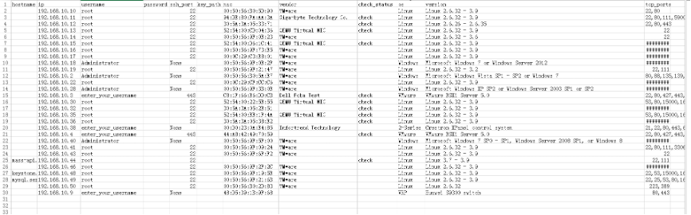

<p align="center"><a href="https://oneprocloud.com"></a></p>
<h3 align="center">云迁移/云灾备必备的调研工具</h3>

<p align="center">
  <a href="https://shields.io/github/downloads/Cloud-Discovery/prophet/total"></a>
  <a href="https://github.com/Cloud-Discovery/prophet"></a>
</p>

--------------------------

- [ENGLISH](https://github.com/Cloud-Discovery/prophet/blob/master/README_EN.md)

## 目录

- [项目说明](#项目说明)
- [安装说明](#安装说明)
- [开发说明](#开发说明)
- [维护人](#维护人)
- [协议说明](#协议说明)

## 项目说明

prophet是一个用于云迁移与云灾备前期技术调研使用的工具，目前主要对源端主机的基本情况进行采集，通过技术指标的比对，确保被调研的源端主机能够正确被HyperMotion/HyperBDR工具正确迁移或灾备。该项目目前已经在多个实际的云迁移和云灾备项目中得到验证，可以放心使用。

该项目未来发展的愿景是提供一站式调研平台，包括但不限于如下资源：各种云平台资源使用状况、文件存储、对象存储、容器平台、大数据平台、中间件、数据库等。同时也将提供蓝图画板，方便在项目前期进行方案编写使用，降低云迁移与云灾备过于冗长的前期调研周期。

目前prophet主要有以下功能组成：

* 通过nmap指令扫描全网存活的主机，并尽量通过包信息分析主机的基本情况
* (稳定)通过VMWare API接口采集主机的详细信息，包含计算、存储和网络等与主机迁移
* (测试)通过Ansible获取Linux主机的详细信息，包含计算、存储和网络等与主机相关信息
* (测试)通过Windows WMI接口采集Windows主机的详细信息，包含计算、存储和网络等与主机相关信息
* (稳定)将采集后的结果以yaml格式进行打包和压缩，并进行脱敏处理（移除用户相关信息）
* (稳定)对采集后的结果进行分析，得出最终的技术调研结论

## 安装说明

### 代码安装

```
git clone https://github.com/Cloud-Discovery/prophet

cd prophet
virtualenv venv
source venv/bin/activate

pip install -r requirements.txt
pip install .
```

### 容器方式

目前该项目每次提交后都会自动进行构建并推送到国内容器源中，可以直接使用

```
docker pull registry.cn-beijing.aliyuncs.com/oneprocloud-opensource/cloud-discovery-prophet:latest
```

## 使用说明

### 基本使用流程

1. 扫描指定的IP地址段
2. 在扫描结果的csv中，填写需要获取详情的主机鉴权信息
3. 批量采集
4. 分析, 得到结果

### (稳定)功能一：扫描全网运行的实例

#### 功能说明

通过网络扫描发现某一网段内存活的主机，并进行记录，可以作为后续更详细信息采集的输入。扫描完成后，将自动在指定路径下生成scan_hosts.csv文件，用于存储信息。

***** 注意：为了防止对生产环境造成较大压力，扫描时采用单进程方式，所以扫描进度较慢，经过测算扫描一个子网掩码为24的子网所需要30分钟左右的时间。**

```
usage: prophet-collect scan [-h] --host HOST [--arg ARG] --output-path
                            OUTPUT_PATH

optional arguments:
  -h, --help            show this help message and exit
  --host HOST           Input host, example: 192.168.10.0/24, 192.168.10.1-2
  --arg ARG             Arguments for nmap, for more detailed, please check
                        nmap document
  --output-path OUTPUT_PATH
                        Generate initial host report path
```

#### 示例一: 获取子网主机

扫描192.168.10.0/24所有存活主机信息，并将csv文件生成在/tmp目录中。

```
prophet-collect scan --host 192.168.10.0/24 --output-path /tmp/
```

#### 示例二: 获取指定IP网段主机

扫描192.168.10.2-192.168.10.50所有存活主机信息，并将csv文件生成在/tmp目录中。

```
prophet-collect scan --host 192.168.10.2-50 --output-path /tmp/
```

#### csv结构说明

| 字段名称         | 字段说明                                                        |
|--------------|-------------------------------------------------------------|
| hostname     | 主机名，可以为空                                                    |
| ip           | 用户IP地址，必须                                                   |
| username     | 用户名，如果为VMware，则为ESXi或者vCenter的用户名                           |
| password     | 密码，如果为VMware，则为ESXi或者vCenter的用户名                              |
| ssh_port     | Linux，该字段为ssh端口VMware ESXi或vCenter则为连接端口，默认为443Windows则默认为空 |
| key_path     | 如果为密钥登陆，需要指定密钥的绝对路径，否则为空                                    |
| mac          | 主机MAC地址，可以为空                                                |
| vendor       | 生产厂商，可以为空，如果是VMware运行的虚拟机则为VMware                           |
| check_status | 是否需要采集详细信息, 如果需要则设置为check，否则工具将自动跳过                  |
| os           | 操作系统类型，目前支持的类型为：Linux/Windows/VMware，大小写敏感                  |
| version      | 操作系统的版本，可以为空                                                |
| tcp_ports    | 对外开放的端口，可以为空                                                |
| do_status    | 详细信息采集状态，表示是否完成采集或者失败，默认为空                                  |

#### 参考样例



### (稳定)功能二：详细信息采集

#### 功能说明

用户在模板填入鉴权信息后，进行进一步详细扫描。

注意：

* 如果是VMware的虚拟机，则只会通过所在的ESXi主机进行扫描
* 如果是Windows主机，需要Administrator用户进行扫描
* 采集主机如果成功，则再次运行脚本时不会再进行采集，除非用户指定force-check参数
* 采集失败的主机在下一次采集时，会重新采集
* 最终生产的压缩包，一切与用户鉴权相关的敏感信息都已经被移除
* (稳定)目前VMware采集部分是稳定的
* (测试)目前Linux和Windows采集部分仍然是测试版本

```
usage: prophet-collect collect [-h] --host-file HOST_FILE --output-path
                               OUTPUT_PATH [-f]

optional arguments:
  -h, --help            show this help message and exit
  --host-file HOST_FILE
                        Host file which generated by network scan
  --output-path OUTPUT_PATH
                        Output path for batch collection
  -f, --force-check     Force check all hosts
```

#### 示例：执行采集

首先需要在生成的scan_csv.csv中更新要采集主机的鉴权信息。


```
prophet-collect collect --host-file /tmp/scan_hosts.csv --output-path /tmp -f
```

#### 采集结果说明

采集目录结构

```
host_collection_info
|-- linux_hosts -> Linux主机采集信息
|-- vmware_hosts -> VMWare主机采集信息
`-- windows_hosts -> Windows主机采集信息
|-- mac_info.yaml -> 所有主机根据Mac地址进行索引，便于后续分析
|-- prophet.log -> 采集过程中的日志，便于对于未知场景分析
|-- scan_hosts.csv -> 采集的主机文件，含开放端口信息
```

另外在输出目录中会生成host_collection_info_xxxxxxx.zip文件，该文件为最终用于分析的压缩文件。

### (稳定)功能三: 分析并输出报告

TODO: 该功能需要进行合并

## 开发说明

### 项目架构

### 代码结构

### 如何构建开发环境

### 如何修改代码

## 贡献者

感谢以下贡献者为本项目做出的贡献

<a href="https://github.com/Cloud-Discovery/prophet/graphs/contributors">
  
</a>

